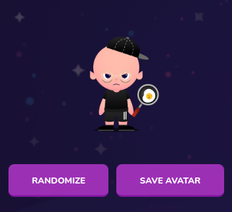

# Avatar

Display student current avatar



```js
     AvatarProps {
        isLoading: boolean;
        currentAvatar: NewUserAvatarDto;
        randomizeHandler: () => void;
        saveAvatarHandler: () => void;
        }
```
