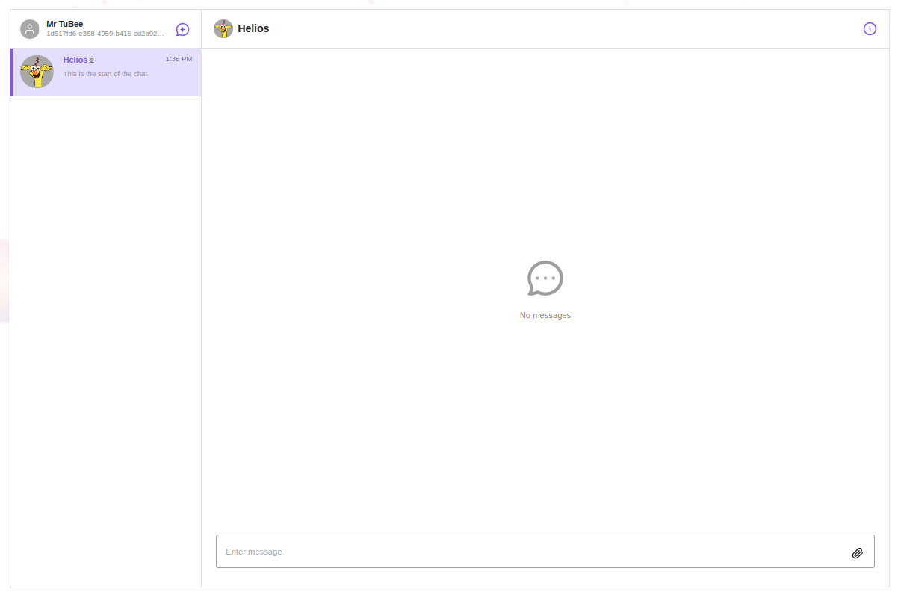

# Send Bird Chat

Used from a external component library to send and receive chats between users



## Props

```js
Props {
  theme?: "light" | "dark";
  userId: string;
  nickname: string;
  profileUrl?: string;
}
```

## Example

```js
<SendbirdChat
  nickname={`${data.me.firstName} ${data.me.lastName}`}
  userId={data.me.id}
  profileUrl={
    data.me.teacher?.photo
      ? data.me.teacher?.photo.url
      : "/images/avatar-placeholder.png"
  }
/>
```
