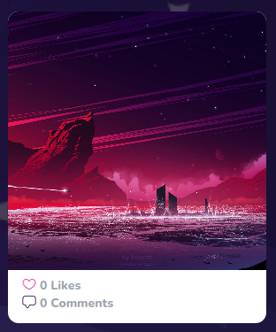

# Challenge Block

Display uploaded challenge cards



## Props

```js
interface Props {
  submission: any;
  index: number;
  sdUrls?: any[];
  likes?: number;
  openModal?: (id: string) => void;
  checkAlreadyLiked: (id: string) => boolean;
  likeSubmission?: (id: string) => Promise<void>;
}
```

## Example

```js
<ChallengeBlock
  submission={submission}
  index={index}
  checkAlreadyLiked={checkAlreadyLiked}
  likeSubmission={likeSubmission}
  openModal={openModal}
  sdUrls={sdUrls}
  key={submission.id}
/>
```
