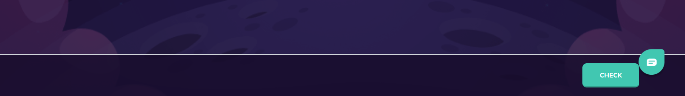

# Checkpoint Footer

Checkpoint footer to check answers and continue to next checkpoint



## Props

```js
interface Props {
  onSecondary?: any;
  onPrimary?: any;
  secondaryText?: string;
  primaryText: string;
  padding?: keyof typeof paddings;
  buttons?: any;
  buttonAttr?: any;
}
```

## Example

```js
<CheckpointFooter
  padding="xs"
  onPrimary={(): void => {
    checkAnswers();
  }}
  primaryText="Check"
  secondaryText="Discuss"
/>
```
