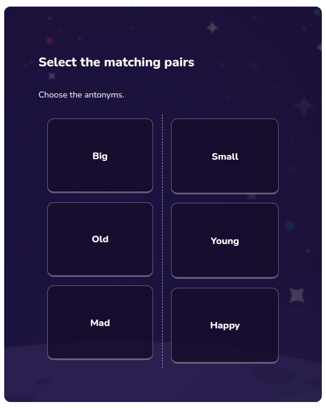

# Matching Preview

Used to preview matching question



## Props

```js
Props {
  block: QuestionBlock;
  isText?: boolean;
}

```

## Example

```js
<MatchingPreview block={block} isText={isText.includes(id)} />
```
