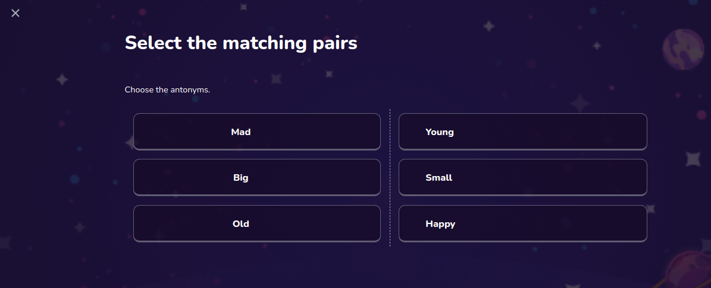

# Matching Question

Used in a quiz for a matching question



## Props

```js
Props {
  block: QuestionBlock;
  selectedAnswers: QuestionSelection[];
  setSelectedAnswers: React.Dispatch<React.SetStateAction<QuestionSelection[]>>;
  courseId: string;
}

```

## Example

```js
<MatchingQuestion
  courseId={checkpoint.course?.id as string}
  block={questions[progress].questionBlock}
  selectedAnswers={selectedAnswers}
  setSelectedAnswers={setSelectedAnswers}
/>
```
