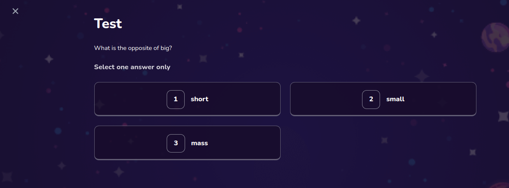

# Objective Question

Used in a quiz for a objective question



## Props

```js
Props {
  block: QuestionBlock;
  selectedAnswers: QuestionSelection[];
  setSelectedAnswers: React.Dispatch<React.SetStateAction<QuestionSelection[]>>;
}

```

## Example

```js
<ObjectiveQuestion
  block={questions[progress].questionBlock}
  selectedAnswers={selectedAnswers}
  setSelectedAnswers={setSelectedAnswers}
/>
```
