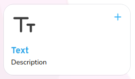
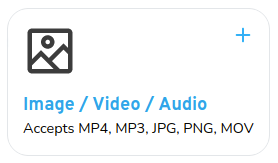
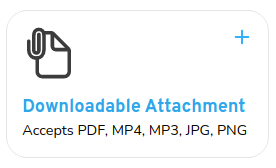

# Lesson Content Card

Used for navigator to add content in lessons







## Props

```js
Props {
  courseId: string;
  blocks: Block[];
  control: Control<FieldValues, object>;
  register: UseFormRegister<FieldValues>;
  currentBlocks: Blocks[];
  setCurrentBlocks: React.Dispatch<React.SetStateAction<Blocks[]>>;
  toDelete: Blocks[];
  setToDelete: React.Dispatch<React.SetStateAction<Blocks[]>>;
  updateTourStep?: any;
}

```

## Example

```js
<LessonContentCard
  name={"Image / Video / Audio"}
  thumbnail={"/images/course/checkpoint/content/content-media.svg"}
  desc={"Accepts MP4, MP3, JPG, PNG, MOV"}
  className="h-full max-w-md col-span-1 navigator_tour_34"
  onClick={createMediaBlock}
/>
```
