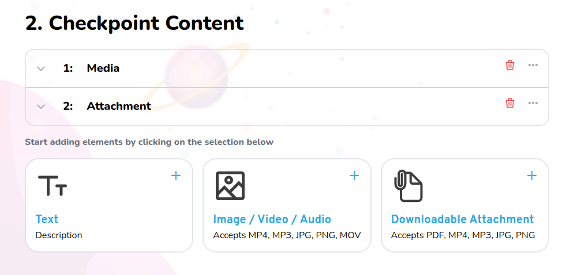

# Lesson

Lesson content management for the navigator



## Props

```js
interface Props {
  courseId: string;
  blocks: Block[];
  control: Control<FieldValues, object>;
  register: UseFormRegister<FieldValues>;
  currentBlocks: Blocks[];
  setCurrentBlocks: React.Dispatch<React.SetStateAction<Blocks[]>>;
  toDelete: Blocks[];
  setToDelete: React.Dispatch<React.SetStateAction<Blocks[]>>;
  updateTourStep?: any;
}
```

## Example

```js
<Lesson
  courseId={
    checkpointResponse.data?.checkpoint.course?.id as string
  }
  blocks={blocks}
  control={control}
  register={register}
  currentBlocks={currentBlocks}
  setCurrentBlocks={setCurrentBlocks}
  toDelete={toDelete}
  setToDelete={setToDelete}
  updateTourStep={updateTourStep}
/>
```
