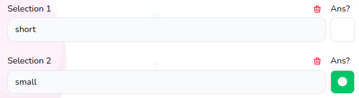

# Block Selection Field

Used for quiz selection question to create choices and mark answers



## Props

```js
interface Props {
  updateSelectionText: any;
  index: number;
  updateSelectionAns: any;
  selection: any;
  block: Blocks;
  answerQuantityType: AnswerQuantityType;
  answerType: AnswerType;
  updateFileForBlock?: any;
  existingFile?: string;
  currentBlocks?: any;
  deleteSelection: any;
}
```

## Example

```js
<BlockSelectionField
    index={index}
    block={block}
    selection={selection}
    updateSelectionText={selectionTextOnChange}
    updateSelectionAns={selectionSingleAnsOnChange}
    key={index}
    answerQuantityType={
    block.answerQuantityType as AnswerQuantityType
    }
    answerType={block.answerType as AnswerType}
    deleteSelection={deleteSelection}
/>
```
