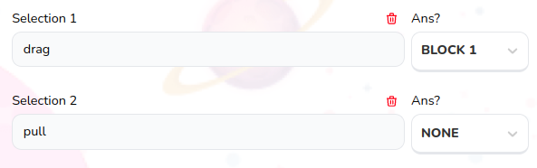

# Drag and Drop Selection Field

Used for quiz drag and drop questions to create choices and mark answers for each block answer



## Props

```js
interface Props {
  updateSelectionText: any;
  index: number;
  updateSelectionAns: any;
  selection: any;
  block: Blocks;
  answerQuantityType: AnswerQuantityType;
  answerType: AnswerType;
  updateFileForBlock?: any;
  existingFile?: string;
  currentBlocks?: any;
  deleteSelection: any;
  questions?: number;
}
```

## Example

```js
<DNDSelectionField
  index={index}
  block={block}
  selection={selection}
  updateSelectionText={selectionTextOnChange}
  updateSelectionAns={selectionAnsOnChange}
  key={index}
  answerQuantityType={"MULTIPLE" as AnswerQuantityType}
  answerType={"TEXT" as AnswerType}
  deleteSelection={deleteSelection}
  questions={block.questions}
/>
```
