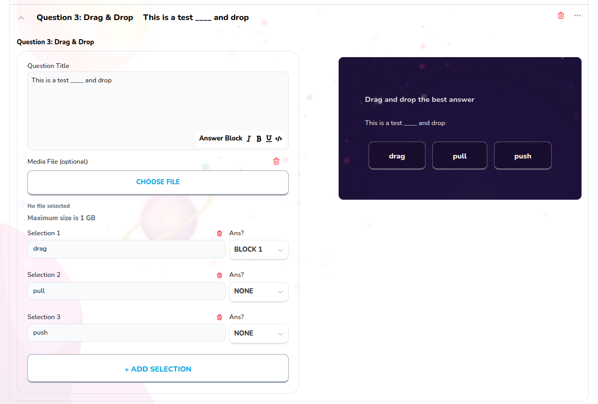

# Quiz Drag and Drop

Used to create quiz drag and drop block, type question, add selection and see preview of the block



## Props

```js
interface Props {
  id?: any;
  onClick?: any;
  index?: number;
  onChange?: any;
  block: Blocks;
  selectionTextOnChange: any;
  selectionAnsOnChange: any;
  updateFileForBlock: any;
  currentBlocks: any;
  deleteSelection: any;
}
```

## Example

```js
<QuizDragAndDrop
  index={index}
  block={block}
  currentBlocks={currentBlocks}
  updateFileForBlock={updateFileForBlock}
  id={block.id}
  onChange={updateDNDQuestion}
  onClick={addBlockSelection}
  selectionTextOnChange={updateSelectionTitle}
  selectionAnsOnChange={updateDNDSelectionOrder}
  deleteSelection={deleteSelection}
/>
```
