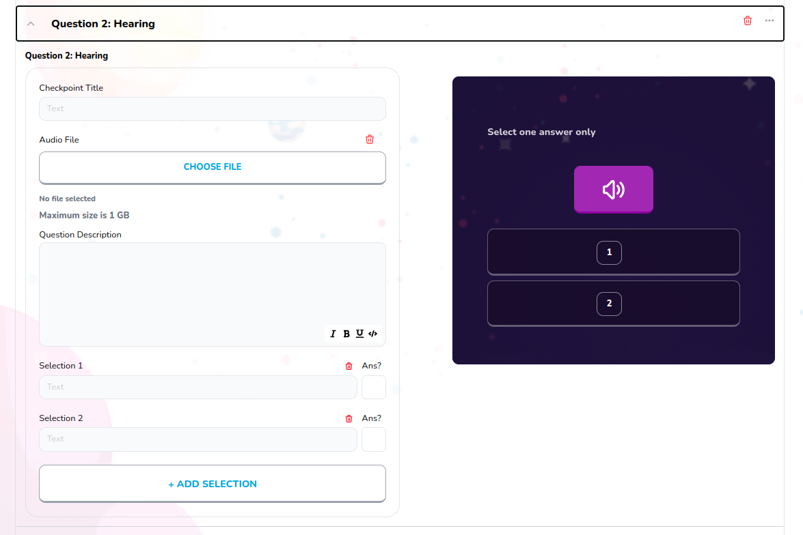

# Quiz Hearing

Used to create quiz hearing block, add question media, type question title, add selection and see preview of the block



## Props

```js
interface Props {
  id: string | number;
  onClick?: any;
  index?: number;
  block: Blocks;
  onChange?: any;
  selectionTextOnChange: any;
  selectionSingleAnsOnChange: any;
  blockDescOnChange: any;
  updateFileForBlock: any;
  currentBlocks?: any;
  deleteSelection: any;
}
```

## Example

```js
<QuizHearing
  id={block.id}
  index={index}
  block={block}
  onClick={addBlockSelection}
  onChange={updateBlockTitle}
  selectionTextOnChange={updateSelectionTitle}
  selectionSingleAnsOnChange={updateSelectionSingleAns}
  blockDescOnChange={updateQuestionDescription}
  updateFileForBlock={updateFileForBlock}
  currentBlocks={currentBlocks}
  deleteSelection={deleteSelection}
/>
```
