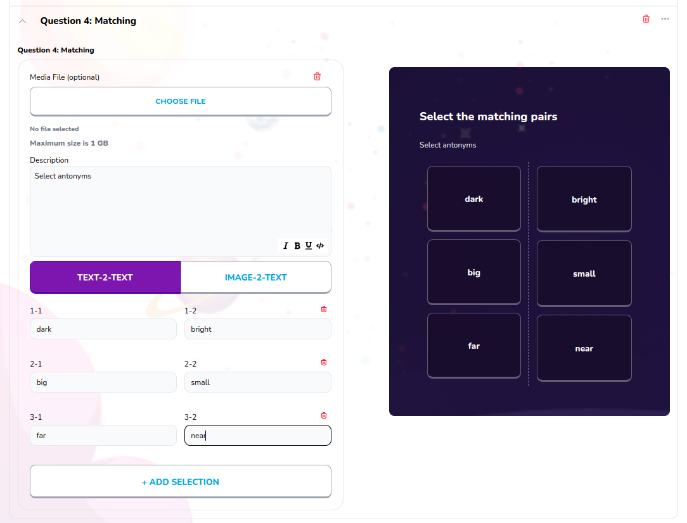

# Quiz Matching

Used to create quiz matching block, type question title, add selection pairs and see preview of the block



## Props

```js
interface Props {
  id: string | number;
  onClick?: any;
  index?: number;
  block: Blocks;
  isText?: any[];
  setIsText?: (value: any[]) => void;
  pairTextOnChange: any;
  blockDescOnChange: any;
  pairAssetOnChange: (
    blockId: string | number,
    pairId: string | number,
    assetId: string,
    url: string,
  ) => void;
  currentBlocks: any;
  updateFileForBlock: any;
  deletePair: any;
}
```

## Example

```js
<QuizMatching
  id={block.id}
  index={index}
  block={block}
  currentBlocks={currentBlocks}
  isText={isText}
  setIsText={setIsText}
  updateFileForBlock={updateFileForBlock}
  blockDescOnChange={updateQuestionDescription}
  onClick={addBlockPair}
  pairTextOnChange={updatePairTitle}
  pairAssetOnChange={updatePairAsset}
  deletePair={deletePair}
/>
```
