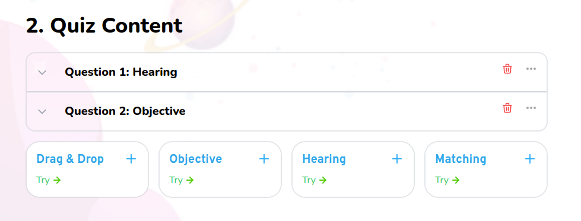

# Quiz

Quiz content management for the navigator



## Props

```js
interface Props {
  blocks: Block[];
  currentBlocks: Blocks[];
  setCurrentBlocks: React.Dispatch<React.SetStateAction<Blocks[]>>;
  toDelete: Blocks[];
  setToDelete: React.Dispatch<React.SetStateAction<Blocks[]>>;
  updateTourStep: any;
  isText?: any[];
  setIsText?: (value: any[]) => void;
}
```

## Example

```js
<Quiz
  blocks={blocks}
  currentBlocks={currentBlocks}
  setCurrentBlocks={setCurrentBlocks}
  toDelete={toDelete}
  setToDelete={setToDelete}
  updateTourStep={updateTourStep}
  isText={isText}
  setIsText={setIsText}
/>
```
