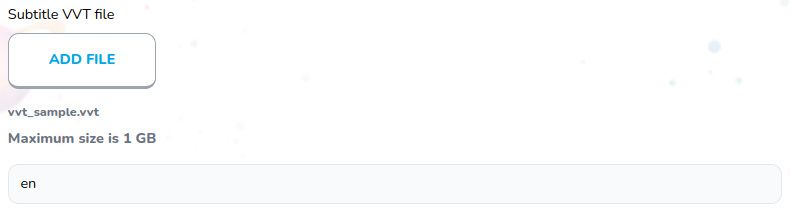

# Subtitle Create

Subtitle language and upload vtt file



## Props

```js
interface Props {
  subtitle: Subtitles;
  subtitleIndex: number;
  block: Blocks;
  blockIndex: number;
  currentBlocks: Blocks[];
  setCurrentBlocks: (value: Blocks[]) => void;
}
```

## Example

```js
<SubtitleCreate
  block={block}
  currentBlocks={currentBlocks}
  setCurrentBlocks={setCurrentBlocks}
  subtitle={subtitle}
  blockIndex={index}
  subtitleIndex={idx}
  key={subtitle.id}
/>
```
