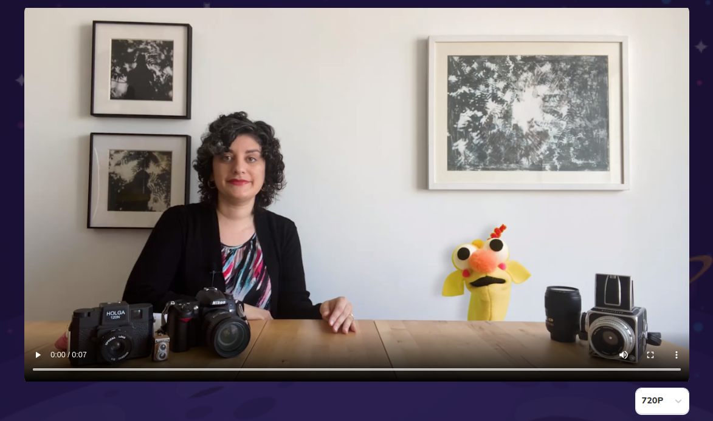

# Video Player

Video player for checkpoint blocks



## Props

```js
interface Props {
  url: string;
  selectProps?: any;
  playerProps?: any;
  subtitles: Subtitles[] | undefined;
}
```

## Example

```js
<VideoPlayer
  url={block.mediaBlock.asset?.url}
  playerProps={{
    className: "w-full aspect-video rounded-2xl",
    width: "100%",
    height: "100%",
  }}
  subtitles={block.mediaBlock.asset.Subtitles}
/>
```
