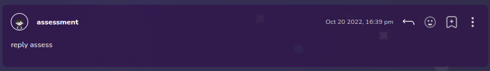

# Forum Comment

Forum post comment



## Props

```js
interface Props {
  isSubcomment?: boolean;
  text: string;
  bookmark?: ForumPostBookmark | undefined;
  username: string;
  commentUserId: string;
  createdAt: string;
  avatarImage?: string;
  mainComment?: {
    text: string,
    user: {
      id: string,
      firstName: string,
      lastName: string,
    },
  } | null;
  id: string;
  reactionCount?: { emoji: ReactionEmoji, count: number }[] | null;
  editComment?: (id: string, text: string) => void;
  deleteComment?: (id: string) => void;
  reactComment?: (id: string, emoji: ReactionEmojies) => void;
  reportComment: (postId: string) => void;
  createBookmark: (postId: string) => void;
  deleteBookmark: (id: string) => void;
}
```

## Example

```js
<Comment
  key={comment.post.id}
  username={comment.post.user.firstName}
  bookmark={
    bookmarks?.findManyBookmarks.find(
      (bookmark) => bookmark.postId == comment.post.id,
    ) as ForumPostBookmark
  }
  commentUserId={comment.post.user.id}
  avatarImage={comment.post.user.student?.avatarImage?.url}
  text={comment.post.text}
  createdAt={comment.post.createdAt}
  isSubcomment={comment.post.isSubComment}
  mainComment={comment.post.parentPost}
  id={comment.post.id}
  reactionCount={comment.post.ForumReaction}
  editComment={handleEditComment}
  deleteComment={handleDeleteComment}
  reactComment={handleReactComment}
  reportComment={handleReportComment}
  createBookmark={handleCreateBookmark}
  deleteBookmark={handleDeleteBookmark}
/>
```
