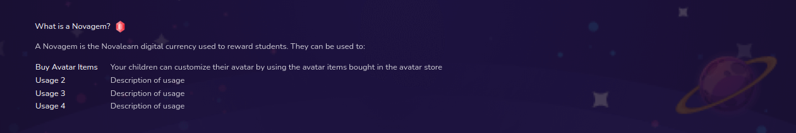

# Gem info

Parents' info on the usage of gems that children collect as rewards



## Props

```js
interface Props {
  hostname?: string;
}
```

## Example

```js
<GemInfo hostname={hostname} />
```
