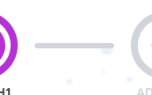

# Checkpoint Connector

Connectors between each checkpoint in the checkpoint map



## Props

```js
interface Props {
  direction: "vertical" | "horizontal";
  className?: string;
  connected?: boolean;
}
```

## Example

```js
<CheckpointConnector
  direction="vertical"
  className="col-span-1 row-span-4"
  connected={false}
/>
```
