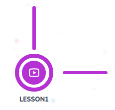

# Checkpoint Space

Checkpoint space which includes connectors, checkpoint title and clickable options that allow child to start checkpoint, and allow navigator to edit or delete checkpoint



## Props

```js
interface Props {
  accept: string;
  text: string;
  data?: Checkpoint;
  connected?: boolean;
  onClick?: any;
  subCheckpointsLength?: number;
  forceVerticalLineAppear?: boolean;
  disableModify?: boolean;
  horizontalConnection?: boolean;
  updateTourStep?: any;
}
```

## Example

```js
<CheckpointSpace
  key={sub.id}
  accept={ItemTypes.SUBCHECKPOINT}
  text={sub.title}
  data={sub}
  subCheckpointsLength={c._count.subCheckpoints}
  connected={sub.order + 1 !== c?.subCheckpoints?.length}
  disableModify={
    course?.published ||
    course?.state === "REVIEW" ||
    course?.state === "PUBLISHED"
  }
  horizontalConnection={sub.order + 1 !== c?.subCheckpoints?.length}
/>
```
