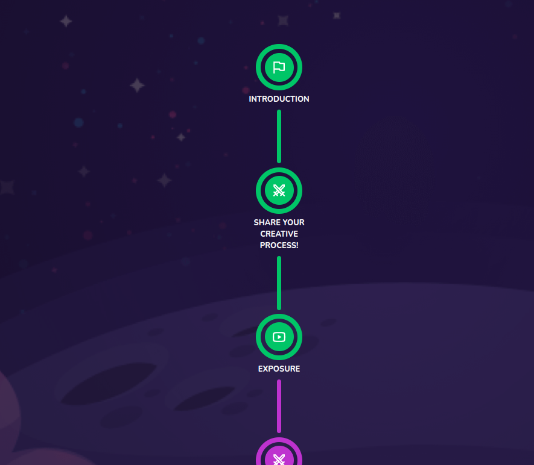

# Checkpoint Space View

Checkpoint space which includes all the checkpoints in the course



## Props

```js
interface Props {
  text: string;
  data: Checkpoint;
  parentConnectedState?: EnrolledState;
  childConnectedState: EnrolledState;
  onClick?: any;
  subCheckpointsLength?: number;
  state: EnrolledState | ExtendedEnrolledState;
}
```

## Example

```js
<CheckpointSpaceView
  {...{
    key: c.id,
    text: c.title,
    data: c,
    state: c.state,
    parentConnectedState:
      index - 1 >= 0 ? array[index].state : EnrolledState.NotStarted,
    childConnectedState:
      c.subCheckpoints && c.subCheckpoints.length > 0
        ? c.subCheckpoints.sort(sortAscending)[0].state
        : EnrolledState.NotStarted,
  }}
/>
```
