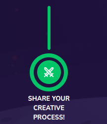

# Course Checkpoint

Display course checkpoint



## Props

```js
interface Props {
  text: string;
  data?: Checkpoint;
  connected?: boolean;
  subCheckpointsLength?: number;
  forceVerticalLineAppear?: boolean;
  disableModify?: boolean;
  horizontalConnection?: boolean;
  updateTourStep?: any;
}
```

## Example

```js
<CourseCheckpoint
  text={text}
  data={data}
  connected={connected}
  subCheckpointsLength={subCheckpointsLength}
  forceVerticalLineAppear={forceVerticalLineAppear}
  disableModify={disableModify}
  horizontalConnection={horizontalConnection || !disableModify}
  updateTourStep={updateTourStep}
/>
```
