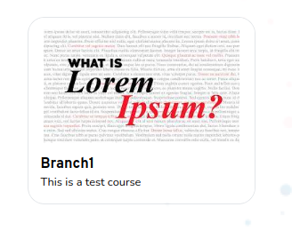

# Checkpoint Card Props

Checkpoint details card display



## Props

```js
interface Props {
  className?: string;
  name?: string;
  desc?: string;
  thumbnail?: string;
  onClick?: any;
  preview?: boolean;
}
```

## Example

```js
<CheckpointCardProps
  name={title || "Title"}
  desc={description || "Description"}
  thumbnail={preview}
  className="w-full max-w-xs h-min navigator_tour_29"
  preview
/>
```
