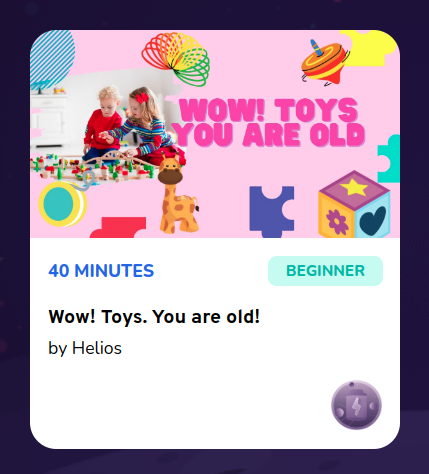

# Course Card Props

Display course details card



## Props

```js
interface Props {
  className?: string;
  name?: string;
  difficulty?: string;
  thumbnail?: string;
  duration?: number;
  teacher?: any;
  category?: Maybe<Category> | undefined;
  isUploadedImage?: boolean;
}
```

## Example

```js
<CourseCardProps
  name={course.title}
  difficulty={course.level}
  category={course.category}
  thumbnail={course.thumbnail?.url}
  duration={course.duration}
  teacher={course.teacher}
  className="cursor-pointer"
/>
```
