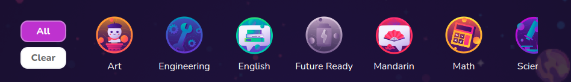

# Course Category Preview

Course Category preview which allows user to filter courses



## Props

```js
interface Props {
  categoryValue: any[];
  setCategory: (value: any) => void;
  categoryPreviews?: any[];
  className?: string;
  isMobile?: boolean;
  memoTenant: any;
}
```

## Example

```js
<CourseCategoryPreview
  categoryValue={category}
  setCategory={setCategory}
  categoryPreviews={categoryOptions}
  isMobile={isMobile}
/>
```
