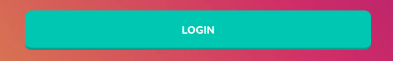

# Button

Re-usable button component



## Props

```js
type IconProps =
  | { startIcon: React.ReactElement; endIcon?: never }
  | { endIcon: React.ReactElement; startIcon?: never }
  | { endIcon?: undefined; startIcon?: undefined };

type ButtonProps = React.ButtonHTMLAttributes<HTMLButtonElement> & {
  variant?: keyof typeof variants;
  size?: keyof typeof sizes;
  justify?: keyof typeof justifyAlignments;
  isLoading?: boolean;
  uppercase?: boolean;
} & IconProps;
```

## Example

```js
<Button
  type="button"
  variant="inverse"
  className="inline-flex justify-center w-full border rounded-md focus:ring-1 focus:ring-offset-1 focus:ring-indigo-500 sm:mt-0 sm:w-auto sm:text-sm"
  onClick={close}
  ref={cancelButtonRef}
>
```
