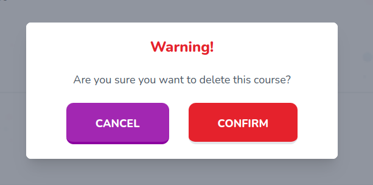

# Dialog

Re-usable dialog component



## Props

```js
interface Props {
  isOpen: boolean;
  onClose: () => void;
  children: React.ReactNode;
  initialFocus?: React.MutableRefObject<null>;
  className?: string;
}
```

## Example

```js
<Dialog
  isOpen={isOpen}
  onClose={(): void => {
    setIsOpen(false);
    setTourOpen(true);
  }}
  className=""
>
```
