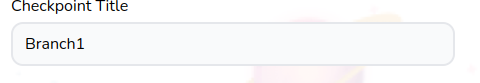

# Block Input Field

Customizable input field



## Props

```js
type FieldWrapperPassThroughProps = {
  label?: string,
  errorClassName?: string,
  error?: FieldError | undefined,
  description?: string,
};

type Props = FieldWrapperPassThroughProps & {
  type?: "text" | "email" | "password",
  className?: string,
  placeholder?: string,
  required?: boolean,
  error?: FieldError,
  onChange?: any,
  id?: string | number,
  value?: string,
};
```

## Example

```js
<BlockInputField
  required
  type="text"
  placeholder="Text"
  onChange={changeSelectionText}
  id={selection.id}
  value={selection.text}
/>
```
