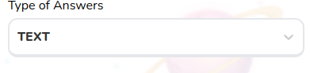

# Block Select Field

Customizable dropdown select field



## Props

```js
type FieldWrapperPassThroughProps = {
  label?: string,
  errorClassName?: string,
  error?: FieldError | undefined,
  description?: string,
};

type Props = FieldWrapperPassThroughProps & {
  id: string | number,
  options: Option[],
  className?: string,
  placeholder?: string,
  onChange: any,
  fieldName: string,
  defaultValue: any,
  isSearchable?: boolean,
  disabled?: boolean,
  value: string,
};
```

## Example

```js
<BlockSelectField
  options={TypeOfAnswers}
  fieldName="typeOfAnswers"
  defaultValue={null}
  value={block.answerType as string}
  id={id}
  onChange={updateTypeOfAnswer}
  className="navigator_tour_57"
/>
```
