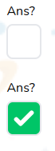

# Checkbox Field

Customizable checkbox field



## Props

```js
type FieldWrapperPassThroughProps = {
  label?: string,
  errorClassName?: string,
  error?: FieldError | undefined,
  description?: string,
};

type Props = FieldWrapperPassThroughProps & {
  className?: string,
  registration?: Partial<UseFormRegisterReturn>,
  error?: FieldError,
  onChange?: any,
  value?: boolean,
  id?: string | number,
};
```

## Example

```js
<CheckboxField
  onChange={changeSelectionIsAns}
  id={selection.id}
  value={selection.isCorrect}
  className="navigator_tour_60"
/>
```
