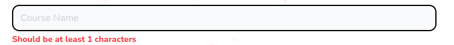

# Field Wrapper

Field wrapper to display errors below input, upload and select fields



## Props

```js
interface Props {
  label?: string;
  className?: string;
  errorClassName?: string;
  children: React.ReactNode;
  error?: FieldError | undefined;
  description?: string;
}
```

## Example

```js
<FieldWrapper label={label} error={error}>
  {child}
</FieldWrapper>
```
