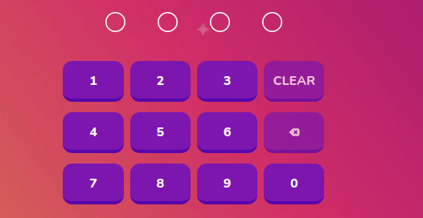

# Number Passcode

Numpad for students' password input



## Props

```js
interface Props {
  codeOnclick?: (data: number) => Promise<any>;
  backSpace?: () => Promise<any>;
  passcode?: string;
  setPasscode: (type: any, data: any) => void;
  error: any;
  clear?: () => Promise<any>;
}
```

## Example

```js
<NumberPasscode setPasscode={setValue} error={errors.loginPattern} />
```
