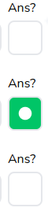

# Radio Field

Radio button field for single selection



## Props

```js
interface Props {
  className?: string;
  registration?: Partial<UseFormRegisterReturn>;
  error?: FieldError;
  onChange?: any;
  value?: string;
  quizType?: string;
  id: string | number;
  groupName: string;
  isChecked: boolean;
}
```

## Example

```js
<RadioField
  onChange={changeSelectionIsAns}
  id={selection.id}
  quizType={block.quizType}
  isChecked={selection.isCorrect}
  groupName={`${selection.id}-${block.id}-group`}
/>
```
