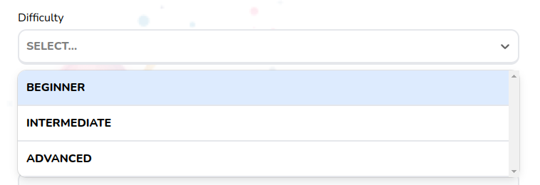

# Select Field

Customizable select dropdown menu



## Props

```js
type FieldWrapperProps = {
  label?: string,
  errorClassName?: string,
  error?: FieldError | undefined,
  description?: string,
};

type Props = FieldWrapperProps & {
  options: Option[],
  errors: {
    [x: string]: any,
  },
  className?: string,
  placeholder?: string,
  control: Control<FieldValues, object>,
  setValue: UseFormSetValue<FieldValues>,
  fieldName: string,
  defaultValue: any,
  isSearchable?: boolean,
  disabled?: boolean,
};
```

## Example

```js
<SelectField
  options={categoryOptions}
  control={control}
  setValue={setValue}
  fieldName="category"
  isSearchable
  defaultValue={null}
  errors={errors}
/>
```
