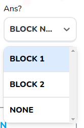

# Select Field No Control

Customizable select dropdown menu with no form control



## Props

```js
type FieldWrapperProps = {
  label?: string,
  errorClassName?: string,
  error?: FieldError | undefined,
  description?: string,
};

type Props = FieldWrapperProps & {
  options: Option[],
  errors?: {
    [x: string]: any,
  },
  className?: string,
  placeholder?: string,
  control?: Control<FieldValues, object>,
  setValue: React.Dispatch<React.SetStateAction<any>>,
  fieldName?: string,
  defaultValue: any,
  isSearchable?: boolean,
  disabled?: boolean,
};
```

## Example

```js
<SelectFieldNoControl
  options={weeks}
  setValue={setSelectedWeek}
  defaultValue={weeks[0]}
/>
```
