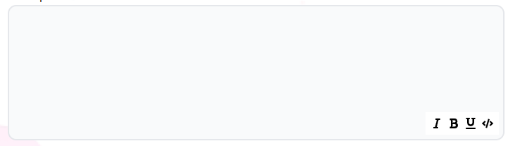

# Slate Field

Input field to allow user bold, italic, underline or code a text, also add dropdown answer block for quiz



## Props

```js
interface Props {
  className?: string;
  setValue?: any;
  onChange?: any;
  id: string | number;
  data?: any;
  answerField?: boolean;
}
```

## Example

```js
<SlateField
  id="description"
  setValue={setValue}
  data={""}
  className="navigator_tour_9"
/>
```
