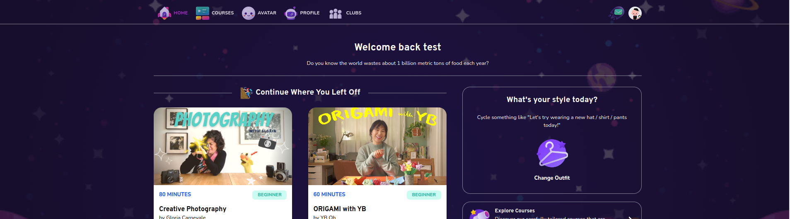

# App Layout

App Layout wrapper which includes the navbar



## Props

```js
interface Props {
  children?: React.ReactChild | React.ReactChild[];
  relative?: boolean;
  darkLayout?: boolean;
  noLayout?: boolean;
  noFooter?: boolean;
  hostname?: string;
}
```

## Example

```js
<AppLayout hostname={hostname} darkLayout noFooter>
  {children}
</AppLayout>
```
