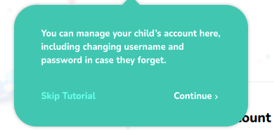

# Parent Arrow Tooltip

Parent onboarding tooltip wrapper



## Props

```js
interface Props extends BeaconRenderProps {
  backProps: {
    "aria-label": string,
    "data-action": string,
    onClick: (e: React.MouseEvent<HTMLElement>) => void,
    role: string,
    title: string,
  };
  closeProps: {
    "aria-label": string,
    "data-action": string,
    onClick: (e: React.MouseEvent<HTMLElement>) => void,
    role: string,
    title: string,
  };
  primaryProps: {
    "aria-label": string,
    "data-action": string,
    onClick: (e: React.MouseEvent<HTMLElement>) => void,
    role: string,
    title: string,
  };
  skipProps: {
    "aria-label": string,
    "data-action": string,
    onClick: (e: React.MouseEvent<HTMLElement>) => void,
    role: string,
    title: string,
  };
  tooltipProps: {
    "aria-modal": boolean,
    ref: React.RefCallback<HTMLElement>,
    role: string,
  };
}
```

## Example

```js
{
  {
      content: (
        <div className="w-64 lg:w-80">
        </div>
      ),
      styles: {
        options: {
          arrowColor: "#00C7B1",
          overlayColor: "rgba(0,0, 0, 0.0)",
        },
      },
  --> tooltipComponent: ParentArrowTooltip,
      placement: "right",
      target: ".navigator_tour_15",
      disableBeacon: true,
      spotlightClicks: true,
    }
}
```
