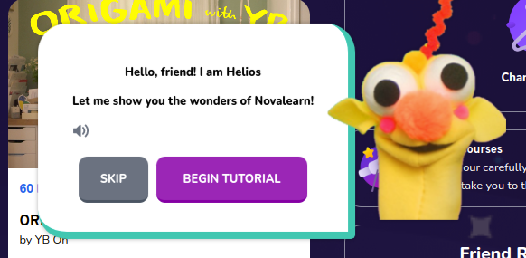

# Tooltip

Student's onboarding tooltip



## Props

```js
interface Props extends BeaconRenderProps {
  backProps: {
    "aria-label": string,
    "data-action": string,
    onClick: (e: React.MouseEvent<HTMLElement>) => void,
    role: string,
    title: string,
  };
  closeProps: {
    "aria-label": string,
    "data-action": string,
    onClick: (e: React.MouseEvent<HTMLElement>) => void,
    role: string,
    title: string,
  };
  primaryProps: {
    "aria-label": string,
    "data-action": string,
    onClick: (e: React.MouseEvent<HTMLElement>) => void,
    role: string,
    title: string,
  };
  skipProps: {
    "aria-label": string,
    "data-action": string,
    onClick: (e: React.MouseEvent<HTMLElement>) => void,
    role: string,
    title: string,
  };
  tooltipProps: {
    "aria-modal": boolean,
    ref: React.RefCallback<HTMLElement>,
    role: string,
  };
}
```

## Example

```js
<Joyride
        callback={handleJoyrideCallback}
        continuous
        hideBackButton
        hideCloseButton
        run={tourOpen}
        scrollToFirstStep
        showProgress
        showSkipButton
        disableCloseOnEsc
        disableOverlayClose
        disableOverlay={false}
        steps={steps}
        stepIndex={tourStep}
        styles={{
          options: {
            width: "auto",
            zIndex: 10000,
          },
        }}
-->    tooltipComponent={Tooltip}
      />
```
