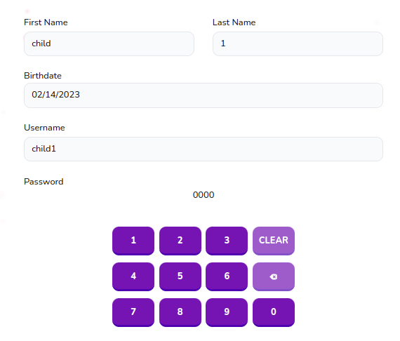

# Child Form

child form for parents



## Props

```js
interface Props {
  onSubmit: (data: CreateChildInput) => void;
  onDelete?: () => void;
  child?: Child;
  type: "add" | "edit";
}
```

## Example

```js
<ChildForm type="add" onSubmit={props.onSubmit} />
```
