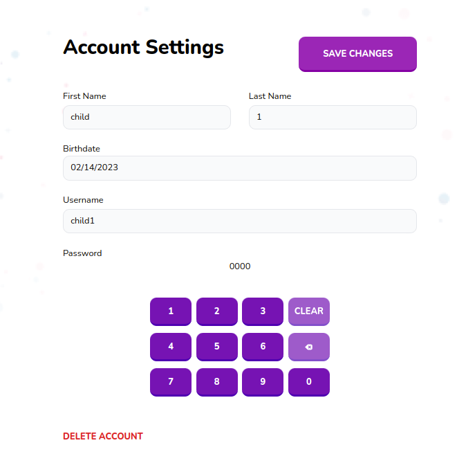

# Edit Child Form

Edit child form for parents



## Props

```js
interface Props {
  onSubmit: (data: CreateChildInput) => void;
  onDelete: () => void;
  child: Child;
}
```

## Example

```js
<EditChildForm
  onSubmit={childSubmit}
  onDelete={childDelete}
  child={childResponse.data.child as any}
/>
```
