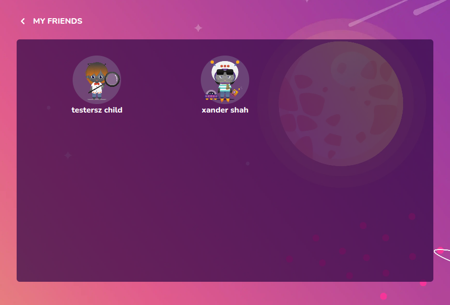

# Friend Section

Preview of list of friends



## Props

```js
interface Props {
  friends: Student[];
  setDisplayTab: (value: "MAIN" | "FRIENDS" | "JOURNAL" | "COURSES") => void;
}
```

## Example

```js
<FriendSection friends={friends} setDisplayTab={setDisplayTab} />
```
