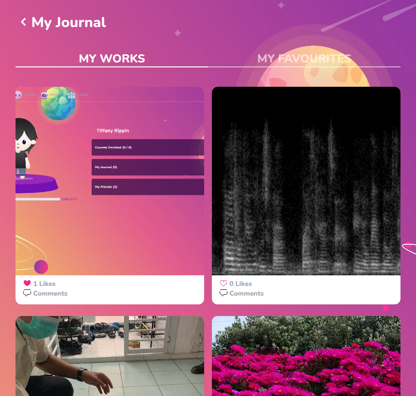

# Journal Section

Preview of the student's journal and the student's favourite



## Props

```js
interface Props {
  journalTab: "WORKS" | "FAVOURITES";
  challenges: FindManyChallengesQuery | undefined;
  checkAlreadyLiked: (id: string) => boolean;
  setJournalTab: (value: "WORKS" | "FAVOURITES") => void;
  setDisplayTab: (value: "MAIN" | "FRIENDS" | "JOURNAL" | "COURSES") => void;
}
```

## Example

```js
<JournalSection
  challenges={journalTab == "WORKS" ? challenges : favouriteChallenges}
  checkAlreadyLiked={checkAlreadyLiked}
  journalTab={journalTab}
  setDisplayTab={setDisplayTab}
  setJournalTab={setJournalTab}
/>
```
