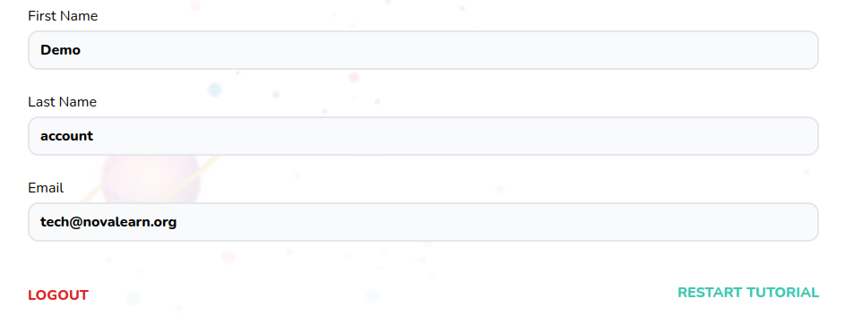

# Account Settings Form

Account settings form



## Props

```js
interface Props {
  errors: {
    [x: string]: any,
  };
  register: UseFormRegister<FieldValues>;
  handleSubmit: UseFormHandleSubmit<FieldValues>;
}
```

## Example

```js
<Account errors={errors} handleSubmit={handleSubmit} register={register} />
```
