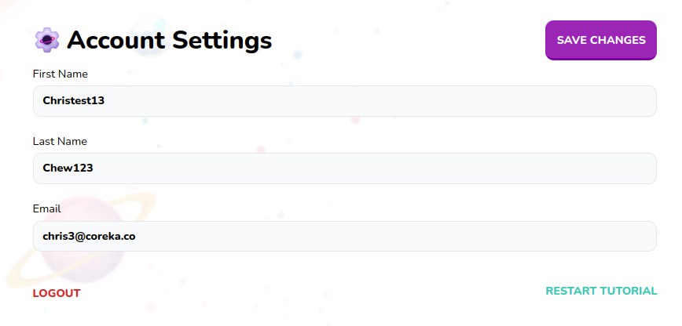

# Settings Form

Settings Form Wrapper that includes logout button and save changes



## Props

```js
interface Props {
  children: any;
  submitCallback: any;
}
```

## Example

```js
<SettingsForm submitCallback={handleSubmit(userSubmit)}>
  {children}
</SettingsForm>
```
