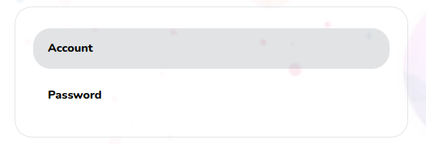

# Settings Tabs

Settings Tabs rendering



## Props

```js
interface Props {
  settings: string[];
  currentSetting: string;
  isDirty: boolean;
  resetFormCallback: () => void;
  darkBg?: boolean;
  changeTabCallback: (value: React.SetStateAction<string>) => void;
}
```

## Example

```js
<SettingsTabs
  settings={settings}
  currentSetting={currentSetting}
  resetFormCallback={resetForm}
  changeTabCallback={changeCurrentSetting}
  isDirty={isDirty}
/>
```
