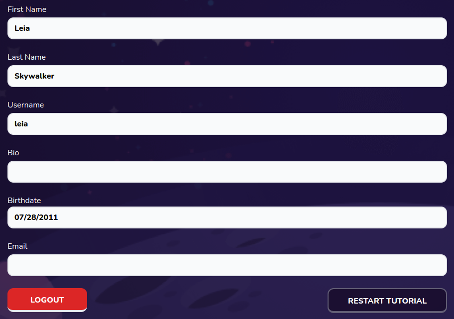

# Account Settings Form

Account settings form



## Props

```js
interface Props {
  errors: {
    [x: string]: any,
  };
  control: Control<FieldValues, object>;
  setValue: UseFormSetValue<FieldValues>;
  register: UseFormRegister<FieldValues>;
  handleSubmit: UseFormHandleSubmit<FieldValues>;
  userId: string;
}
```

## Example

```js
<AccountSettings
  handleSubmit={handleSubmit}
  errors={errors}
  register={register}
  control={control}
  setValue={setValue}
  userId={user?.id || ""}
/>
```
